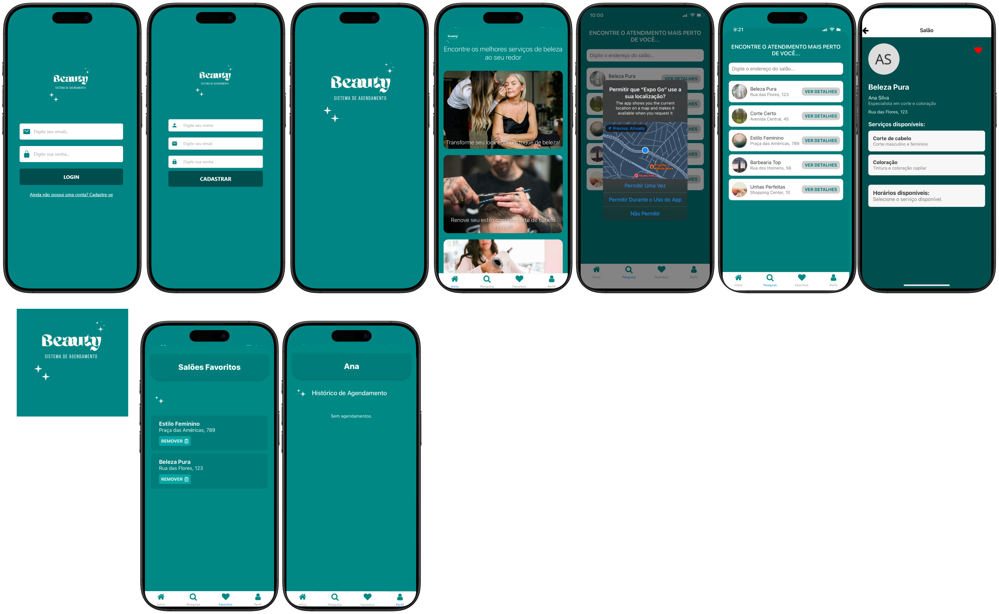

# Beauty App

O **Beauty App** é um aplicativo desenvolvido para ajudar os usuários a encontrar o salão de beleza mais próximo, agendar horários e gerenciar seus salões favoritos. O app permite que o usuário pesquise salões por localização, visualize os serviços oferecidos e até mesmo marque compromissos diretamente pelo celular.
<br>
(Projeto de extensão da Faculdade)



## Api do projeto
Desenvolvido por uma integrante do grupo:
```bash
https://github.com/VitoriaLuizaDeveloper/beauty-api.git
```

## Funcionalidades

- **Cadastro**: Realize o cadastro de um novo usuário no aplicativo.
- **Login**: Autentique-se com um login seguro para acessar suas funcionalidades personalizadas.
- **Página Inicial**: Dicas e informações úteis sobre cuidados pessoais e beleza.
- **Pesquisa de Salões**: 
  - Encontre salões digitando o nome ou usando a localização para encontrar os salões mais próximos.
  - Veja a lista de salões disponíveis de acordo com sua localização.
- **Serviços do Salão**: Visualize os serviços oferecidos pelos salões, com detalhes sobre preços e disponibilidade.
- **Favoritos**: 
  - Adicione salões aos favoritos.
  - Remova salões dos favoritos a qualquer momento.
- **Agendamento de Horários**: Agende um horário com o salão diretamente pelo app.
- **Histórico de Agendamentos**: 
  - Veja os agendamentos realizados.
  - Cancele um agendamento se necessário.

## Tecnologias Usadas

- **React Native**: Framework para desenvolvimento de aplicativos móveis.
- **Expo**: Ferramenta para facilitar o desenvolvimento e deploy de apps React Native.
- **TypeScript (TSX)**: Linguagem para adicionar tipagem estática e facilitar o desenvolvimento.
- **AsyncStorage**: Utilizado para armazenamento local de dados (ex: token de autenticação, favoritos, etc.).

## Como Rodar o Projeto

### Pré-requisitos

- **Node.js**: Você precisará do Node.js instalado para rodar o projeto. Se ainda não o instalou, pode baixar [aqui](https://nodejs.org/).
- **npm**: (geralmente já incluído com o Node.js).
- **Expo**: Ferramenta para facilitar o desenvolvimento de aplicativos React Native.
- **Expo Go**: Instalado no seu celular / necessário criar uma conta.
  
**Clone o repositório:**:
```bash
git clone https://github.com/ribbeiroana/beuty_app.git
```

**Instale as dependências:**:
```bash
npm install
```

**Inicie o servidor de desenvolvimento**:
   ```bash
   npm start
```

### Emuladores
Para testar o aplicativo em um emulador Android ou iOS, utilize o Expo para emular o aplicativo em dispositivos móveis.

- **IOS / Android**:  Use o comando npm start e aponte seu celular para o Qrcode.
